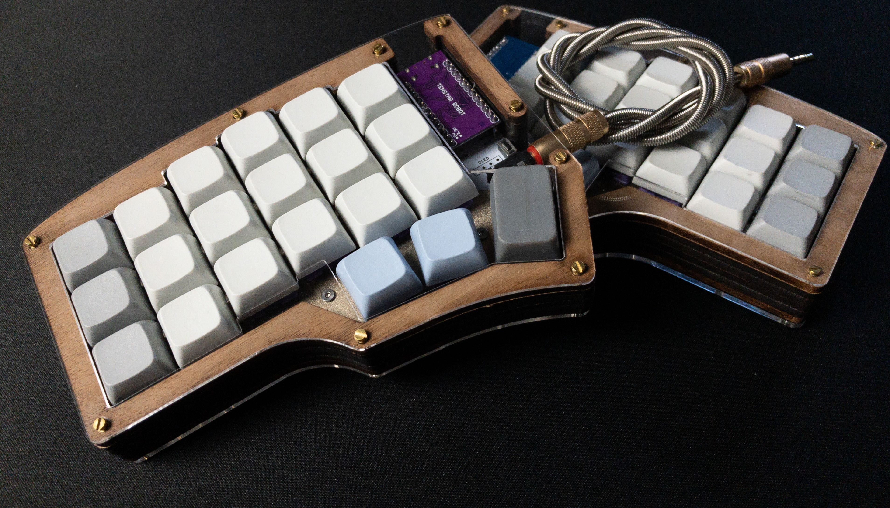

# Corne Cherry Keyboard Builds

## Fancy Case Build

Find relavent files and parts list in the [fancy_case](fancy_case/) directory.

---

## 3D Print Case Build

Find relavent files in [3dprint_case](3Dprint_case/)

---

## Electronics Parts List

Note that there are several vendors that sell kits. If you want to have full control over the components, colors, etc. then here is my list of items.  Note that all links worked when this was written, but you may have to search for similar items if they are now broken.

I started with [this post](https://www.reddit.com/r/crkbd/comments/esv3i8/guide_corne_diy_kit/) when searching for parts.  If you want to add LED's, there's information about those there.

|Item|Price (USD)|Shipping to USA (USD)|MinimumPurchasable Quantity|Units Required for 1 Keyboard|How many more keyboards can be made|Price Each|Price per Keyboard|Ordered|TOTAL NEEDED TO SPEND:|
|---|---|---|---|---|---|---|---|---|---|
|[Pro Micro Type C](https://www.aliexpress.com/item/1005003227884730.html)|$4.86|$2.32|1|1|1.0|$7.18|$7.18|2|$7.18|
|[Pro Micro Pins](https://www.aliexpress.com/item/32803164240.html)|$1.87|$3.57|15|2|6.5|$0.36|$0.73|15|$5.44|
|[Pro Micro Sockets](https://www.aliexpress.com/item/32817226478.html)|$1.87|$3.75|15|2|6.5|$0.37|$0.75|15|$5.62|
|[TRRS Jack](https://www.aliexpress.com/item/33029465106.html)|$0.80|$3.60|10|2|4.0|$0.44|$0.88|10|$4.40|
|[TRRS Cable](https://www.aliexpress.com/item/32459681560.html)|$3.03|$4.77|2|1|1.0|$3.90|$3.90|2|$7.80|
|[Reset Switch](https://www.aliexpress.com/item/1005001629184984.html)|$0.81|$0.89|50|2|24.0|$0.03|$0.07|50|$1.70|
|[Diodes](https://www.aliexpress.com/item/32849879904.html)|$0.75|$1.47|100|42|1.4|$0.02|$0.93|100|$2.22|
|[Switch Sockets](https://www.aliexpress.com/item/4000019410050.html)|$21.90|$0.38|90|42|1.9|$0.25|$10.40|120|$22.28|
|[OLED](https://www.aliexpress.com/item/32777216785.html)|$1.54|$2.85|1|2|1.0|$4.39|$8.78|4|$8.78|
|**TOTALS**|||||||**$39.66**||**$95.65**|