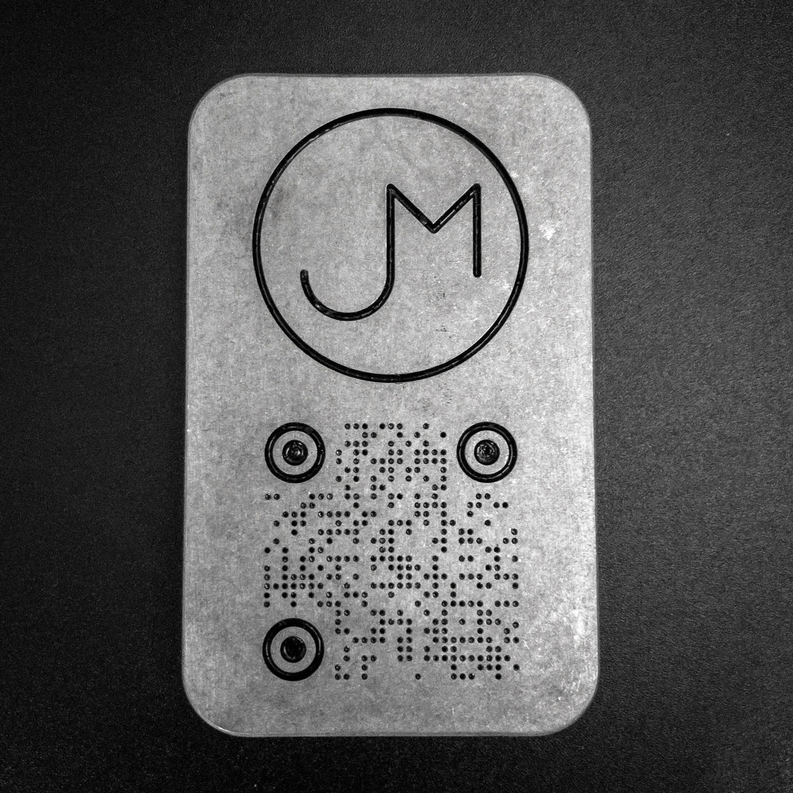

# Business Card Holder

Business in the front, business in the back.  I probably won't be handing out buckets of business cards, but if I happen to run out, or for those who have gone paperless, I have a QR code to my LinkedIn on the back (works at arm's length). Note that I put the whole thing in a vibratory tumbler to knock off all the shine, otherwise the QR code doesn't really work.

The front has a [spring steel money clip](https://www.amazon.com/Lindenle-Spring-Capacity-Minimalist-Pocket/dp/B0827HZKDQ/ref=asc_df_B0827HZKDQ/?tag=hyprod-20&linkCode=df0&hvadid=693771153575&hvpos=&hvnetw=g&hvrand=12436096795476842346&hvpone=&hvptwo=&hvqmt=&hvdev=c&hvdvcmdl=&hvlocint=&hvlocphy=9029709&hvtargid=pla-853363498958&psc=1&mcid=6e92c74814d93e978dd70262c64a2fc5&gad_source=1) screwed down to hold business cards.  If I were to make a second prototype, I'd stay away from spring steel, both for manufacturing and use.
