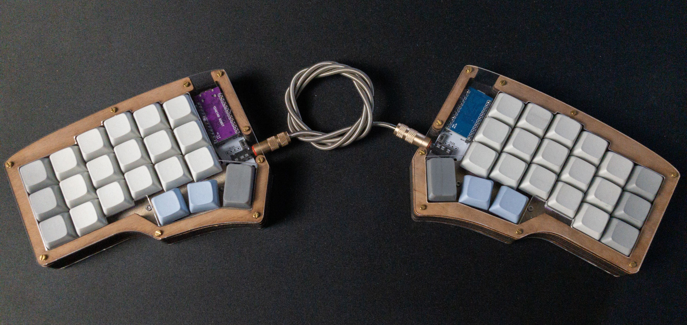
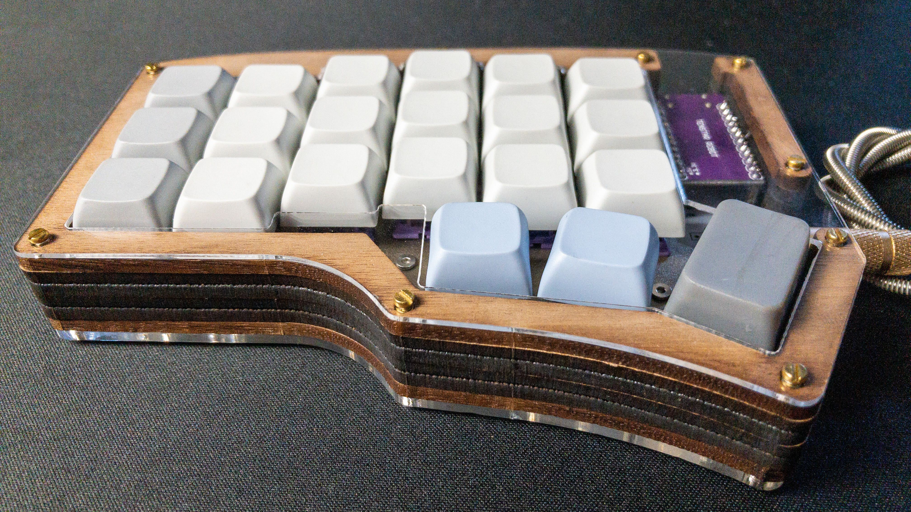
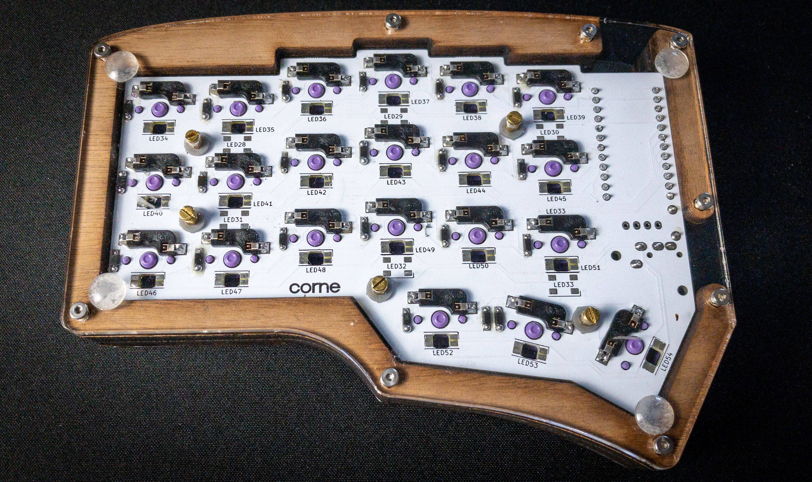

# Fancy Case Notes

## Intro

This is the first case I made. I've included the original [CAD (SolidWorks) files](CAD_files/), the files I used for [laser cutting](laser_cutter_files/), and the file I used to 3D print the ["plugs"](3Dprint_files/plug.STL) for my standoffs to work with the 4mm PCB holes.

Note that I didn't actually laser cut the plates on mine. I actually CNC milled them.  That being said, it's much better to laser cut them, so I've only included those files. (The CNC CAD is very similar, but slightly adjusted to account for the fact that you can't cut square easily.)

Also note that in the process of milling out the plates I messed up the brass stock beyond salvaging. The plate in the photos is actually a steel scrap I picked up.  After milling, I sandblasted it for texture and then baked it in an oven at 500F for about 2 hours to try and get the surface oxidation the right thickness to approximate a brass color.  I don't think the oven actually got up to 500F though, since it should probably be a little darker at that temperature.

## Parts List:

### Assembly Items

These are the screws, spacers, etc. I used to put the case together.

|Item|Notes|Price (USD)|Shipping to USA (USD)|Purchasable Quantity|Units Required for 1 Keyboard|How many more keyboards can be made|Price Each|Price per Keyboard|Ordered|TOTAL NEEDED TO SPEND:|
|---|---|---|---|---|---|---|---|---|---|---|
|[Rubber Pads](https://www.aliexpress.com/item/4000266239818.html)|for grip on the bottom|$2.29|$2.03|50|10|4.0|$0.09|$0.86|50|$4.32|
|[Washers (M2x4mmx0.5mm)](https://www.aliexpress.com/item/1005003631594043.html)|For extra 0.5mm between PCB and Plate|$0.99|$0.00|100|10|9.0|$0.01|$0.10|100|$0.99|
|[3mm M2 threaded 3mm spacers](https://www.aliexpress.com/item/1005003346233271.html)|between plate and pcb|$3.21|$0.00|50|10|4.0|$0.06|$0.64|50|$3.21|
|[3mm M2 Spacers](https://www.aliexpress.com/item/1005003223706742.html)|between pcb and base|$3.90|$0.00|50|10|4.0|$0.08|$0.78|50|$3.90|
|[Screws (M2x4mm)](https://www.aliexpress.com/item/4000225587487.html)|fancy screws that show on top face. Also used to connect base to spacers on bottom (could use these everywhere on bottom and not get 5mm M2 screws)|$2.97|$0.00|100|28|2.6|$0.03|$0.83|100|$2.97|
|[18mm M2 spacers](https://www.aliexpress.com/item/1005002913946631.html)|through all wood layers|$4.75|$0.00|30|18|0.7|$0.16|$2.85|30|$4.75|
|[middle screws top (M2x3mm)](https://www.aliexpress.com/item/1005003411992910.html)|connect plate to spacer|$1.70|$0.00|50|10|4.0|$0.03|$0.34|50|$1.70|
|[middle screws bottom (M2x5mm)](https://www.aliexpress.com/item/1005003411992910.html)|"connect base to wood spacers (could have used 4mm screws here instead. In fact| should make these 4mm screws if using anyway)"|$1.88|$0.00|50|18|1.8|$0.04|$0.68|50|$1.88|
|**TOTALS**||||||||**$7.08**||**$23.72**|

### Raw Materials

If ordering from a laser cutting company, there's no need to purchase these materials.

|Item|Notes|Price (USD)|Shipping to USA (USD)|Purchasable Quantity|Units Required for 1 Keyboard|How many more keyboards can be made|Price Each|Price per Keyboard|Ordered|TOTAL NEEDED TO SPEND:|
|---|---|---|---|---|---|---|---|---|---|---|
|[Brass (1.5mmx200mmx300mm)](https://www.aliexpress.com/item/1005002295553163.html)|for plate (don't need to buy material if having someone else|$27.51|$2.11|1|0.5|1.0|$29.62|$14.81|1|$29.62|
|[3mm acoustic foam](https://www.aliexpress.com/item/32938741689.html)|between pcb and base plate|$1.89|$3.60|1|1|1.0|$5.49|$5.49|2|$5.49|
|[wood (1/8"x6"x24")](https://ocoochhardwoods.com/scroll-saw-lumber/walnut/#walnut)|For top and bottom middle layers (I used particle board for the layers between since it was cheaper and I had it on hand.)|$8.40|$8.43|1|0.5|1.0|$16.83|$8.42|1|$16.83|
|[3mm Acrylic (25x25cm)](https://www.aliexpress.com/item/4000270915715.html)|for base|$18.43|$0.00|2|1|1.0|$9.22|$9.22|2|$18.43|
|[1mm Acrylic (5x7")](https://www.amazon.com/dp/B09KXZCPWR?psc=1&ref=ppx_yo2_dt_b_product_details)|for face|$6.99|$0.00|6|2|24.0|$1.17|$2.33|50|$6.99|
|**TOTALS**||||||||**$40.26**||**$77.36**|